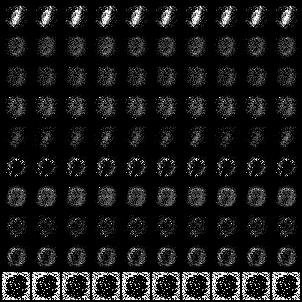
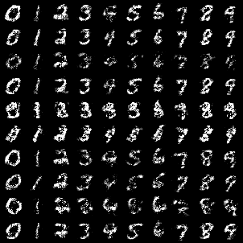
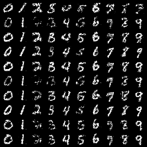
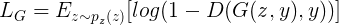
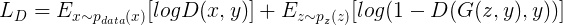

# Conditional Generative Adversarial Nets

This repository is implemented by Pytorch.

**CGAN** : [Paper](https://arxiv.org/abs/1411.1784)

## Result

All results are randomly sampled.

*Epoch 1* | *Epoch 10* | *Epoch 25*
:---: | :---: | :---: |
 |  | 

## Loss

 *Description* |*Value Function* |
:---: | :---: |
Generator Loss |  |
Discriminator Loss |  |

## Getting Start
### Download data
- Download in current space
- Output : raw_data folder, MNIST file
```shell
python dataset_download.py 
```

### modeling
- training_set = {60000 * 28 * 28 size, 0-255 value, 0-9 label}, test_set = {10000 * 28 * 28 size, 0-255 value, 0-9 label} 
- Input : raw_data folder, MNIST file
- Output : saved_image folder, images_per_epoch, saved_model folder, generator model, discriminator model
```shell
python modeling.py 
```

### evaluating
- Input : saved_model folder, generator model
- Output : evaluated_image folder, eval_images
```shell
python evaluating.py
```

## Issue
<span style="color:red">
mode collapse 문제가 발생하여 network에 regularization 제약을 주고자 batchnorm을 적용하였다.
적용결과 클래스별 이미지가 잘 생성되었으나 단일 클래스 이미지를 생성하고자 할 때 적절한 이미지가 나오지 않았다.
0~9 클래스 정보를 줄 경우 이미지가 잘 생성되는 실험 결과로 보아 batchnorm에서 학습된 내용이 모든 클래스의 정보 평균을 이용하는 문제가 있을 것으로 생각된다.
</span>